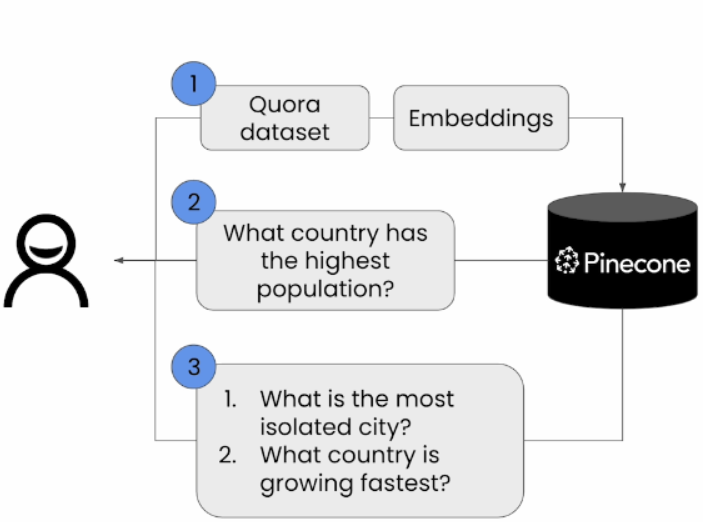

# semantic_search
simple semantic_search app using pinecone vector database

## Semantic_search :

Type of search that focus on the meaning of the content being search

## Pinecone :

Vector database that store and retrieve vector in a high dimensional space

## steps :

1. Download quora dataset
2. turns it into embeddings
3. store it in pinecone
4. search for similar questions

## Workflow

